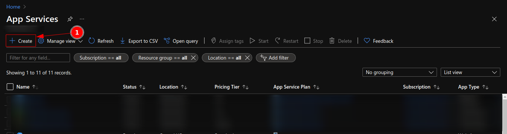

# Version Updates (1.0.4)

1) Windows compatibility fixed.
2) Added scaffolding option for React and Node.js projects that provide you with ready to develop projects
3) Added cleanup handling in case of errors for <code>git</code>. (<code>git reset --soft HEAD~1</code>). See lower for conflict resolution tips
4) Async-Await implementation of pipelines, leading to a much cleaner code base
5) Tested on Ubuntu and  Garuda Dragonized (Arch Linux) distros.
6) The cleanups are still in experimental phase except from the unstaging of a commit. 
7) Shorter giddy-config.json templates and reduction to two instead of three
8) The double repository pattern for React projects is no longer supported.


# What is Giddy
Giddy is an automated scaffolding and DevOps pipeline tool, built with Node.js that makes the setup and deployment
of React and Node.js applications on Azure feel like a breeze. You simply provide Giddy with
a <code>.json</code> config file, and the rest are done for you automatically (except from Git credentials
insertion). However, forget about initializing projects, installing basic packages, building bundles, logging in, retrieving details,
pushing to repositories, deploying etc.

### Full project source code can be found [here]

# Installation

In order to run Giddy from anywhere on your computer you need to install
it globally. 

```npm
npm i -g @geomak/giddy
```

After installing it, <code>giddy</code> will be available to run from your command line.
Start by typing <code>giddy -h</code> to check the options.

# Options
The below option will set the type of project you want to set up and deploy or simply deploy.
Current options are <code>react</code> and <code>node</code> 
```git
-a or --app with two choices react or node
```

The below option will set the type of operation you want to perform for the selected type of
project. 

The option <code>deploy</code> allows you to re-deploy an already existing app you have
on Azure. 

The option <code>init</code> first creates an application of the selected app type, initializes
repositories, updates them, and finally makes an initial deployment, in order to only use 
the <code>deploy</code> option in the future.

```git
-t or --type with two choices deploy or init
```


# Arguments

<code>giddy</code> requires a single argument which is the path to your <code>giddy-config.json</code>


# Example usage

### Deploy an existing React application on Azure

```git
giddy -a react -t deploy absolute/path/to/giddy-config.json
```

### Deploy an existing Node application on Azure

```git
giddy -a node -t deploy absolute/path/to/giddy-config.json
```

### Scaffold and deploy a new React application on Azure

```git
giddy -a react -t init absolute/path/to/giddy-config.json
```

### Scaffold and deploy a new Node.js application on Azure

```git
giddy -a node -t init absolute/path/to/giddy-config.json
```


# What you will need - Package dependencies

1) Node.js
2) Git
3) azure-cli ^2.0


# JSON config templates

There are two standard templates that <code>giddy</code> recognizes and this is mostly 
to distinguish the deployment pipeline from the scaffolding pipeline.


### Scaffold giddy-config.json
```json
{
     "resource_group_name": "<name-of-resource-group> (existing or new)",
     "location": "<location of the service according to Azure standards. e.g. westeurope>",
     "app_name": "<the-name-to-give-to-the-app>",
     "git_username": "<your-git-username>",
     "git_password": "<your-git-access-token>(as from 13, Aug 2021)",
     "git_email": "<your-git-email>",
     "commit_message": "a commit message e.g. v1.0.0"
}

```
The above template is the standard scaffolding template that Giddy recognizes in order to
initialize a new project of the selected type, and perform the initial operations (repo creation,
app service creation, resource group creation, repository update, and finally the initial deploy).
Once the pipeline is finished, you'll be prompted with a link to check your new application live.
For Node.js apps, to check if the app is running after the pipeline, visit the 
<code>/api/default/get</code> route. In React applications, the form has embedded validations and will
not let you submit it empty, so just type a random username and password, and it will let you in.


### Deploy template
```json
{
  "resource_group_name": "<the-resource-group-name-of-the-app>",
  "app_name": "<the-app-service-name>",
  "source_code_path": "absolute/path/to/source/code",
  "remote_name": "<name-of-source-code-remote> defaults to origin",
  "branch_name": "<name-of-source-code-branch> defaults to main",
  "commit_message": "v1.0.1",
  "git_username": "<your-git-username>",
  "git_password": "<your-github-access-token>"
}
```
The above template is the standard <code>giddy-config.json</code> template for the deployment
of an existing app on Azure. It works for projects that aren't scaffolded with <code>giddy</code>
as well, as long as the information are correct


# Usage guide from scratch

## Step 1: Create an Azure App Service

In Azure Portal click on App Services and then <code>+Create</code> to create a new App Service.



The name you will give to your app is what needs to be put in the 
<code>"app_service_name"</code> property of your <code>giddy-config.json</code>  

## Step 2: Create a React project
    
This applies to any React project, but for the sake of the tutorial let's go with a new empty project
with <code>create-react-app</code>. Once scaffolding is finished, make sure that a local repository is initialized.
If it isn't, initialize a local repository with <code>git init</code> and add <code>/node_modules</code> to it. The path to your project
is what goes in the <code>"source_code_path"</code> property of your <code>giddy-config.json</code>


## Step 3: Create the remote
    
Login to your GitHub account and create a repository, for your source code.
Then create an authorization token to use as your password. From Aug 13, 2021 and onwards, GitHub uses 
authentication tokens instead of account passwords. 
Go to:
1) Your account settings
2) Developer settings
3) Personal access tokens
4) Generate new token
5) Follow the process
6) Save your token somewhere safe because you won't be able to see it again.
Finally, link each remote with each local repository by doing: 
```git
git remote add <a remote name you want> <link to remote from your repo> 
```

## Step 4: Create your giddy-config.json

It's not the name giddy-config.json that matters most but the format and so, you can 
name it however you want as long as it has a <code>.json</code> extension and the format is correct.
Copy the "deploy" template from above and replace the values of the properties with your matching ones.
You can retrieve the remote and branch name by doing <code>git remote</code> and <code>git branch</code> 
respectively inside a repository. The current branch will be marked with a <code>*</code>

## Step 5: Run giddy

Finally, open a terminal window and type
```npm
giddy -a react -t deploy /path/to/giddy-config.json
```
For example, if you are on Ubuntu and your <code>giddy-config.json</code> is on your
Desktop type: 

```npm
giddy /home/<your username>/Desktop/giddy-config.json
```

That's it! Save your <code>giddy-config.json</code> and continue developing your app.
From now on, all you need to do whenever you want to build, push and deploy your application, 
is to change the commit message in your <code>giddy-config.json</code> and run <code>giddy</code>

### The above five steps are equivalent to running <code>giddy -a react -t init path/to/giddy-config.json</code> .

### Apart from the obvious benefits of brevity, <code>giddy</code> also provides you with all the tools that you 

### will need plus the boilerplate code for them. (packages, Context API, routes, styling...all the goodies to build upon)


# Conflict resolution after <code>git reset --soft HEAD~1</code>

    git add . 
####
    git commit -m "your commit message"
####
    git pull <remote> <branch>
####
```git
Fix conflicts manually and accept or abort changes
```
####
```git
Rerun giddy
```

# React scaffold packages

The React project includes:

1) react-router-dom
2) react-query
3) antd and ant-design icons
4) react-transition-group
4) Context API implementation
5) Three routes ('/' (login), '/home' (home), '/todo' (demo of react-query))
6) A 404 fallback page in case a route is not in the router
7) Links to the documentation of each library

# Node.js scaffold packages

The Node.js application includes:

1) Express.js
2) cors
3) body-parser
4) dotenv
5) nodemon
6) Four default demo routes ('/api/default/get', '/api/default/post', '/api/default/put', '/api/default/delete')

The goal is to set you up as quickly as possible, with a project that has all boilerplate code
ready, initialized repositories, and the Azure resources necessary together with your first deployment.
That way you can focus only on the development and deploy again your app through giddy in a single command.


### Full project source code can be found [here]

### Feel free to submit any bugs or issues on GitHub or at gmakroglou23@gmail.com

[here]: https://github.com/G-MAKROGLOU/-geomak-giddy